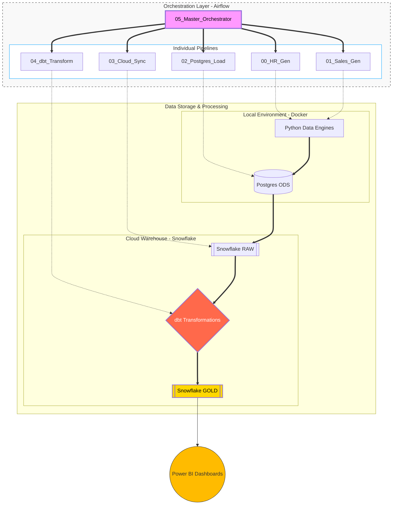

# 🚀 Alfa Stream v4.5: Hybrid Cloud Data Platform

**CZ:** Alfa Stream v4.5 je komplexní end-to-end datová platforma simulující reálný e-commerce provoz. Projekt demonstruje orchestraci hybridního cloudu, pokročilé dbt modelování a plně inkrementální datové toky (Delta Load).

**EN:** Alfa Stream v4.5 is a comprehensive end-to-end data platform simulating real-world e-commerce operations. The project demonstrates hybrid-cloud orchestration, advanced dbt modeling, and full incremental data flows (Delta Load).

---

## 🏗️ Architecture / Architektura

---

## ⚙️ Pipelines Overview / Přehled procesů

**CZ:** Systém je řízen Master Orchestrátorem (DAG 05), který sekvenčně spouští:
- **00 & 01A:** Správa Master dat (Zaměstnanci, Produkty).
- **01B & 01C:** Inkrementální generování Trafficu a Objednávek (Sezónnost, Peak Hours).
- **02 & 03:** Load do lokálního Postgresu a následný vektorizovaný přesun do Snowflake RAW.
- **04:** Inkrementální dbt transformace do vrstev SILVER (Staging) a GOLD (Business Marts).

**EN:** The system is governed by a Master Orchestrator (DAG 05), executing sequentially:
- **00 & 01A:** Master Data Management (Employees, Products).
- **01B & 01C:** Incremental generation of Traffic and Orders (Seasonality, Peak Hours).
- **02 & 03:** Load to local PostgreSQL and vectorized transfer to Snowflake RAW.
- **04:** Incremental dbt transformations into SILVER (Staging) and GOLD (Business Marts).

---

## 🌟 Key Features / Klíčové funkce

**CZ:**
- **Incremental Logic (Delta Load):** Všechny vrstvy od simulace po dbt zpracovávají pouze nové přírůstky, což minimalizuje náklady na Snowflake compute.
- **Advanced dbt Modeling:** Transformace surových dat do granulárních byznys pohledů (Hourly Traffic, Monthly Sales Performance).
- **Enterprise Orchestration:** Robustní Master DAG s logikou `wait_for_completion` a automatickým testováním kvality dat (`dbt test`).
- **Snowflake Stability:** Vyřešení kritických metadatových konfliktů při cloudovém nahrávání (Manual Drop & Append strategy).

**EN:**
- **Incremental Logic (Delta Load):** All layers, from simulation to dbt, process only new increments, minimizing Snowflake compute costs.
- **Advanced dbt Modeling:** Transformation of raw data into granular business views (Hourly Traffic, Monthly Sales Performance).
- **Enterprise Orchestration:** Robust Master DAG with `wait_for_completion` logic and automated data quality checks (`dbt test`).
- **Snowflake Stability:** Resolved critical metadata conflicts during cloud ingestion (Manual Drop & Append strategy).

---

## 🛠️ Tech Stack / Technologie

- **Orchestration:** Apache Airflow (LocalExecutor ready)
- **Data Engineering:** Python (Pandas), SQL
- **Database:** PostgreSQL (Docker), Snowflake (Cloud)
- **Transformation:** dbt Core (Incremental Materialization)
- **Visualization:** Power BI

---

## 📖 Documentation / Dokumentace

**CZ:** Kompletní technický popis, schéma databáze a řešení problémů naleznete ve složce:

**EN:** Full technical description, database schema, and troubleshooting can be found in the folder:

👉 [**Project Documentation Folder (CZ/ENG)**](./documentation/)

---

**Author:** David Urban  
**Status:** Production v4.5 (Orchestrated & Incremental)
