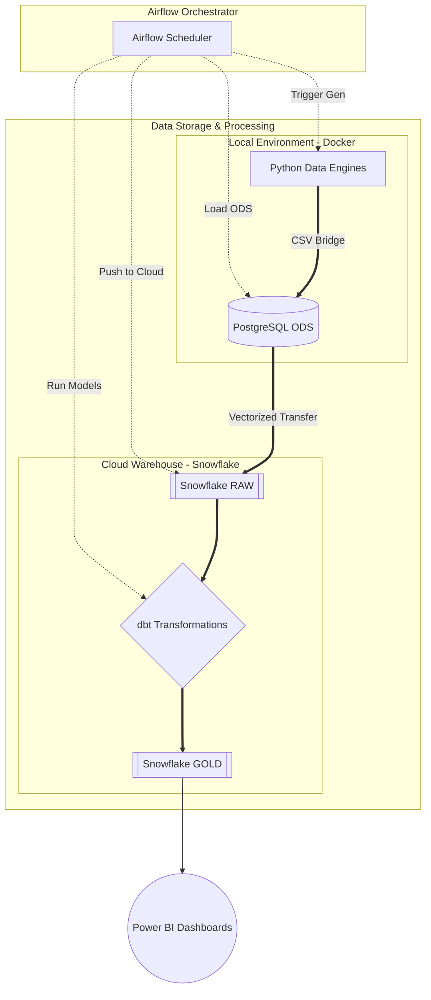

# 🚀 Alfa Stream v4.0: Hybrid Cloud Data Platform

**CZ:** Alfa Stream v4.0 je komplexní end-to-end datová platforma simulující reálný e-commerce provoz. Projekt demonstruje integraci lokálního vývojového prostředí (Docker) s podnikovým cloudovým skladem (Snowflake).  
**EN:** Alfa Stream v4.0 is a comprehensive end-to-end data platform simulating real-world e-commerce operations. The project demonstrates the integration of a local development environment (Docker) with an enterprise cloud data warehouse (Snowflake).

---

## 🏗️ Architecture / Architektura
**CZ:** Airflow funguje jako centrální orchestrátor (Control Plane) oddělený od samotných datových toků.  
**EN:** Airflow acts as a central orchestrator (Control Plane), decoupled from the actual data movement.

---

## 🌟 Key Features / Klíčové funkce

### **CZ:**
- **Market Simulator:** 5letá historie (2021–2026) se sezónností (Vánoce 3.5x peak) a denními špičkami (Peak Hours).
- **Business Logic:** Atribuce objednávek na aktivní zaměstnance a upsell doplňkových služeb.
- **High-Performance Bridge:** Vektorizovaný přenos 1.3M+ záznamů do Snowflake pomocí chunkování.
- **Modern Data Stack:** Integrace dbt pro transformaci dat přímo v cloudu.

### **EN:**
- **Market Simulator:** 5-year history (2021–2026) with seasonality (3.5x Christmas peaks) and daily Peak Hours.
- **Business Logic:** Order attribution to active staff and upsell logic for add-on services.
- **High-Performance Bridge:** Vectorized transfer of 1.3M+ records to Snowflake using chunking.
- **Modern Data Stack:** dbt integration for in-cloud data transformations.

---

## 🛠️ Tech Stack / Technologie
- **Orchestration:** Apache Airflow
- **Local Database:** PostgreSQL (Docker)
- **Cloud Warehouse:** Snowflake
- **Transformations:** dbt (Core/Cloud)
- **Analysis:** Python (Pandas), SQL
- **Visualization:** Power BI

---

## 📖 Documentation / Dokumentace
**CZ:** Kompletní technický popis a řešení problémů naleznete zde:  
**EN:** Full technical description and troubleshooting can be found here:

- 🇨🇿 [**Technická dokumentace (CZ)**](./documentation/documentation_CZ.md)
- 🇬🇧 [**Technical Documentation (ENG)**](./documentation/documentation_ENG.md)

---

## 🚀 Roadmap / Budoucí rozvoj
1. **Real-time Ingestion:** Transition to Snowflake Snowpipe.
2. **Predictive Analytics:** ML forecasting based on 5-year historical data.
3. **Data Governance:** Automated dbt testing and data lineage.

---
**Author:** David Urban  
**Status:** Production v4.0 (Hybrid Cloud Ready)